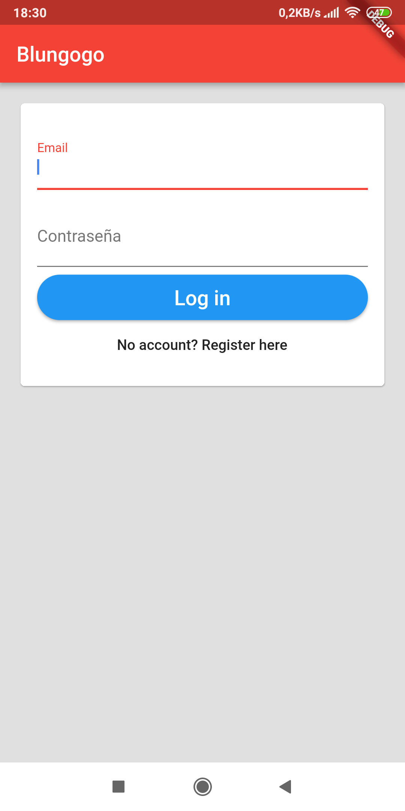
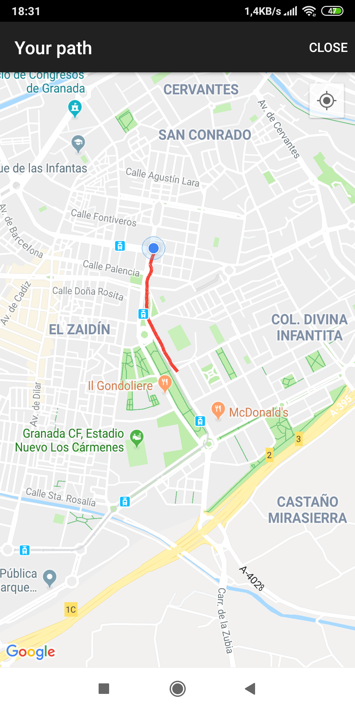
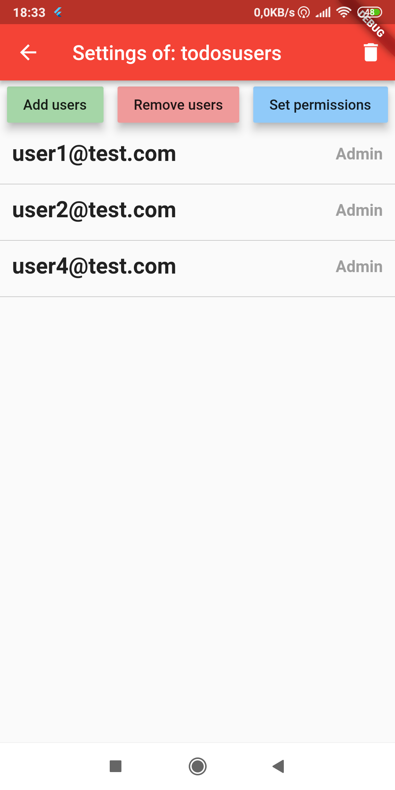

# TFG-Blungogo
Android app to track physical activities and performance

This application is the final project of my CS degree. It has been developed with Flutter, using Firebase Firestore and Firebase Authentication.

During the user's activities, data will be gathered from the GPS of the device to be processed and shown to the user through clear and 
intuitive interfaces. These activities can be visualized in detail, showing the user some metrics (total time, total distance, average speed...)
and displaying a map view of the path followed during the activity. 

To allow users to compare themselves and track their performance over time I implemented a groups system and a comparisons one.
This comparisons system shows several charts to the user, one per metric, allowing the user to compare his/her performance or other's people 
performance in a certain time interval.

The [documentation](https://github.com/davidpeinao/TFG-Blungogo/blob/master/Documentation.pdf) (only in Spanish) shows every
aspect of the development of this application, that includes:

 * Definition of objectives and state of the art study
 * Planification and budget
 * Analysis and requirements
 * Design
 * Implementation
 * Conclusions and future works
 * User's manual

